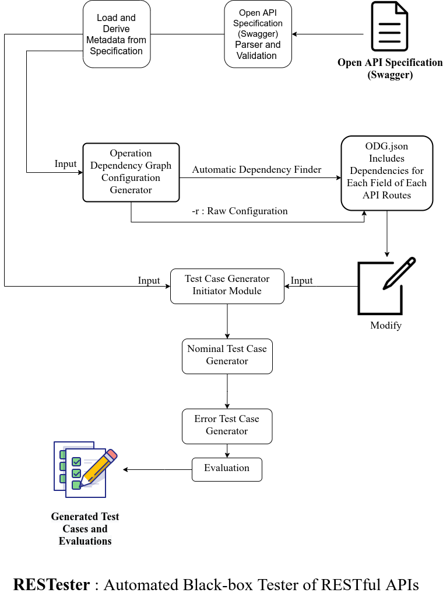

# OpenAPI Specification Toolkit : RESTester

## Automatic Black-box Tester for RESTful APIs

Inspired by this [Article](https://ieeexplore.ieee.org/abstract/document/9159077) and tried to improve the methods which are used in this paper.

## Project Summary

### Overview

Take a look at this diagram :

**Author : [Mohammad Mahdi Mohajer](https://github.com/mmohajer9/)**
